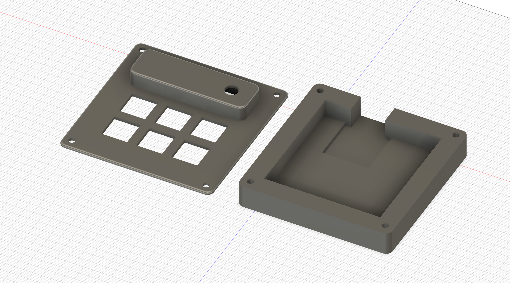
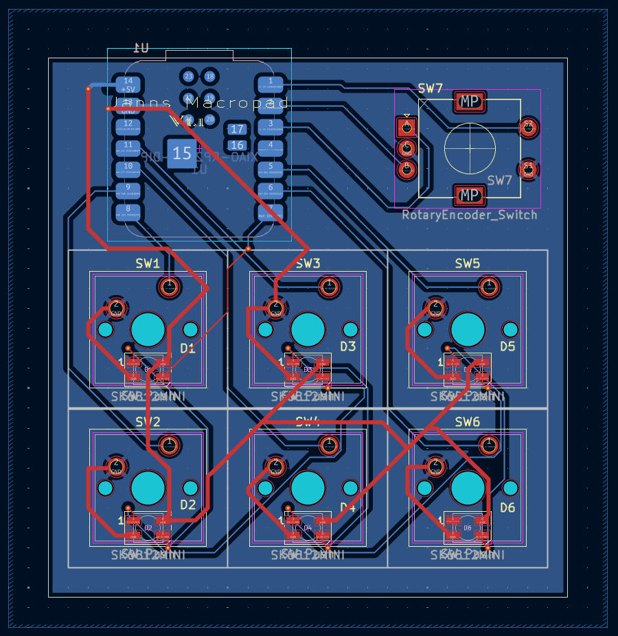
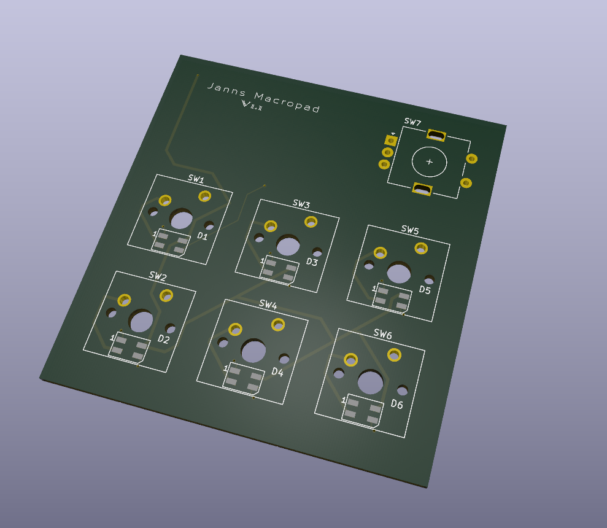
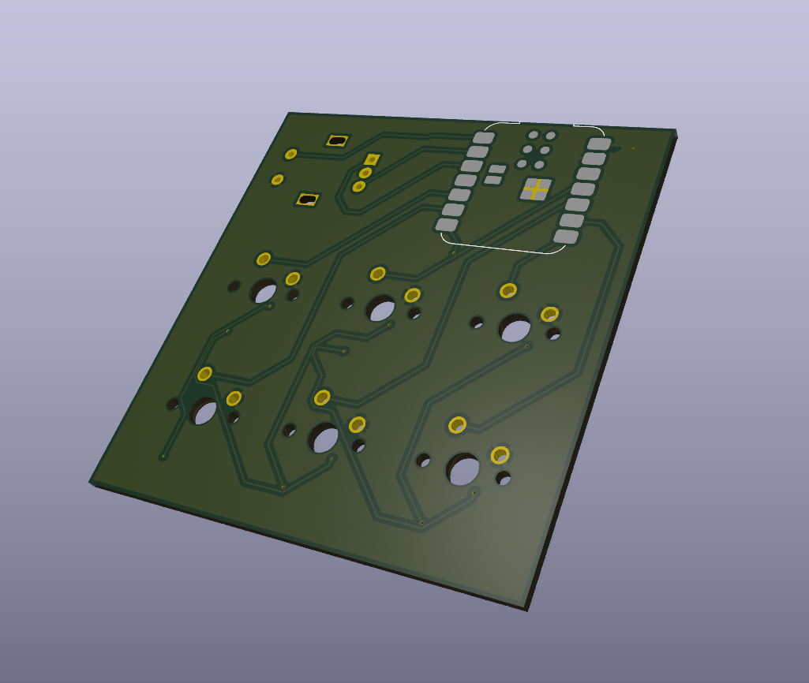
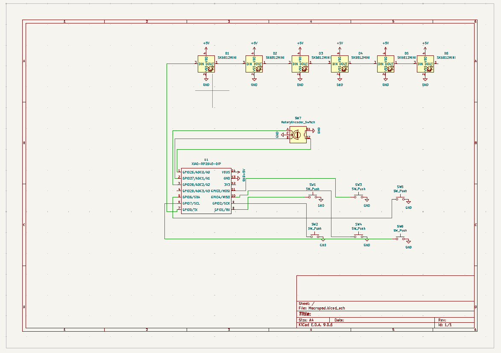

# My Macropad

Welcome to my Macropad project! 
This repository contains all the design files for the case, the PCB, and the firmware necessary to build this custom keypad.

## Project Overview

This project is a fully custom-designed macropad built around the Seeed XIAO RP2040 microcontroller.
Designed as part of the Hack Club submission, the goal was to create a functional, budget-friendly input device.

The device features are 6 mechanical switches for a tactile typing experience.
The PCB was created using KiCad, keeping the layout clean and efficient on a 2-layers.

Running on QMK firmware, the pad is fully programmable, allowing users to customize keymaps for gaming, coding shortcuts, or media control.
It serves as both a practical tool and a showcase of custom hardware design.

## Design & Visuals

Per the submission requirements, here are the different views of the project:

### 1. The Assembled Macropad (Render)
A 3D render of the complete assembly (Case + PCB):

### 2. Case Design
The 3D printed Case and Top:

### 3. PCB Layout
A view of the PCB routing:

### 4. Schematic
The electronic schematic for the device:

---

## Default keymap

* **SW1** Copy
* **SW2** Undo
* **SW3** Clipboard (Paste)
* **SW4** Explorer
* **SW5** Cut
* **SW6** Taskmanager

### Rotary Encoder (EC11)

Modes are changet by pressing the switch of the Encoder:

* **Mode 1** Volume
* **Mode 2** RGB Brightness
* **Mode 3** RGB Pattern

## Bill of Materials (BOM)

Here are the parts required to build this macropad:

| Component | Quantity | Description / Notes |
| :--- | :---: | :--- |
| Seeed XIAO RP2040 | 1 | The main microcontroller |
| Cherry MX Switches | 6 | (or compatible clones) |
| Keycaps | 6 | Compatible with chosen switches |
| SK6812 MINI-E LED | 6 | (or fitting neopixel-leds) |
| EC11 Rotary encoder | 1 | For Volume, Brightness, ect. |
| 3D Print Filament | - | PLA or PETG for the case |
| Screws | 4 | M3x16mm for assembly (Thread trough Plastic) |

---

## Features

* **MCU:** Seeed XIAO RP2040
* **Firmware:** QMK
* **Connectivity:** USB-C

## License
This project is open source.
